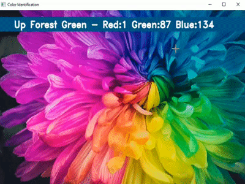

## _Color Identification in Images_
* ### _Level: Beginner_
* ### _Problem Statement:_
> _Implement color detector which identifies all the colors in an image or video_
* ### _Implementation: [color_identification.py](./color_identification.py)_
* ### _Sample Output:_

---
